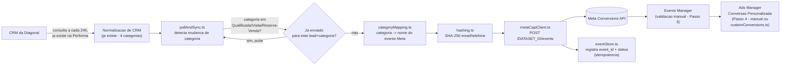

# Piloto: CRM → Meta Conversions API (Conta Diagonal)

> **Status: pacote teórico.** Nenhum código aqui foi executado ou testado contra
> infraestrutura real. Todo ponto que exigiria uma credencial, ID ou trecho do
> código existente da Performa está marcado com `[PLACEHOLDER_TEORICO]` ou
> descrito como "ASSUMIDO". Este README é o ponto de entrada — leia antes de
> mexer em qualquer arquivo de `src/`.

## 1. O que este pacote resolve

A Performa já normaliza qualquer CRM em 4 categorias (Desqualificada,
Qualificada, Visita, Reserva/Venda) e já cria Público Personalizado no Meta a
partir disso — **isso não faz parte deste pacote**.

O que falta, e é o que este pacote implementa: pegar a mudança de categoria de
um lead e mandar isso pro Meta como **evento de conversão via Conversions API
(CAPI)**, atrelado ao Dataset/pixel da conta Diagonal, para depois virar uma
Conversão Personalizada selecionável no Ads Manager.

Escopo: piloto de uma conta só (Diagonal). Nada aqui deve rodar para outros
clientes até o piloto ser validado (ver seção 7, Definição de Pronto).

## 2. Suposições assumidas (documentar antes de portar para o repo real)

Estas são decisões que tomei sem informação do briefing, para poder escrever
código real em vez de pseudocódigo. Revise cada uma antes de integrar:

| Suposição | Por quê | Se estiver errada |
|---|---|---|
| Stack: TypeScript/Node.js | Não foi informado no briefing. Escolhido por portabilidade — mais fácil de traduzir para qualquer outra stack do que pseudocódigo. | Traduza a *lógica* de cada arquivo (o contrato de dados e o payload da CAPI são o que realmente importa manter) para a linguagem real da Performa. |
| Banco: Postgres | Assumido pelo padrão comum em stacks Node/TS. | Adapte `db/schema.sql` para o dialeto real (MySQL, etc.) |
| Existe uma função/serviço que expõe o estado normalizado atual de cada lead (`getNormalizedLeadStatuses`, ver `src/pollAndSync.ts`) | O briefing confirma que a normalização já existe, mas não descreve a interface de acesso a ela. | Troque a declaração `declare function` em `pollAndSync.ts` pela chamada real ao módulo existente da Performa. |
| Nome de evento para "Qualificada" = `Lead` (padrão Meta), não custom `Qualified` | O briefing deixa as duas opções em aberto. `Lead` é evento **padrão**, o que permite objetivo de campanha nativo "Geração de Leads"; `Qualified` seria customizado, mais preciso semanticamente mas só usável via Conversão Personalizada/otimização manual. | Trocar em `src/categoryMapping.ts`, é uma linha. Decisão de negócio, não técnica — vale confirmar com o cliente/Nuno antes do piloto real. |
| Leads da Diagonal são todos BR (DDI 55) | Não informado. Afeta a normalização de telefone antes do hash (Meta exige E.164). | Ajustar `normalizePhoneBR` em `src/hashing.ts` se houver leads internacionais. |
| Um scheduler externo (cron, worker, etc.) já existe na Performa e só precisa apontar para uma nova rotina | O briefing descreve "consulta periódica a cada 24h" como já implementada — este pacote assume que só falta plugar a lógica de envio nessa rotina existente. | `scripts/run-daily-poll.ts` é o ponto de entrada a ser chamado por esse scheduler. |

## 3. Arquitetura



## 4. Mapa de arquivos

```
performa-capi-piloto-diagonal/
├── README.md                    este arquivo
├── db/
│   └── schema.sql                tabela nova: meta_conversion_events (idempotencia + auditoria)
├── src/
│   ├── config.ts                 env vars, allowlist do piloto, placeholders
│   ├── types.ts                  contratos de dados (NormalizedCategory, ConversionEvent, etc.)
│   ├── hashing.ts                normalizacao + SHA-256 de email/telefone (exigencia da Meta)
│   ├── categoryMapping.ts        categoria normalizada -> evento Meta (Diagonal)
│   ├── metaCapiClient.ts         monta o payload e chama a Conversions API
│   ├── eventStore.ts             idempotencia: nunca reenviar o mesmo lead+categoria
│   └── pollAndSync.ts            a rotina em si: le leads, detecta mudanca, envia
└── scripts/
    ├── send-test-events.ts       Passo 2 do piloto: 1 evento de teste por categoria
    ├── run-daily-poll.ts         ponto de entrada para o scheduler de producao
    └── create-custom-conversions.ts   Passo 4 automatizado (opcional - ver secao 6)
```

## 5. Variáveis de ambiente / credenciais necessárias

Nenhuma tem valor real neste pacote — são todas placeholders a preencher na
hora de rodar de verdade.

| Variável | Descrição | Onde conseguir |
|---|---|---|
| `META_SYSTEM_USER_TOKEN_DIAGONAL` | Token do system user com permissão "Gerenciar Pixel" no dataset da Diagonal | Business Manager da Diagonal → Configurações do Negócio → Usuários do Sistema |
| `META_DATASET_ID_DIAGONAL` | ID do Pixel/Dataset da Diagonal | Business Manager → Events Manager → Configurações da Fonte de Dados |
| `META_TEST_EVENT_CODE_DIAGONAL` | Código de teste (só usado no Passo 2/3 da validação, **remover depois**) | Events Manager da Diagonal → aba "Testar Eventos" |
| `DIAGONAL_CLIENT_ID` | ID interno do cliente Diagonal dentro da Performa | Banco de dados / painel admin da Performa |
| `DATABASE_URL` | Connection string do Postgres da Performa | Já existe na infra da Performa |

## 6. O que este pacote automatiza vs. o que continua manual

**Automatizado (código neste pacote):**
- Detecção de mudança de categoria (dado que a normalização já exista)
- Envio do evento via CAPI, com hash correto de `user_data`
- Idempotência (nunca reenviar o mesmo lead+categoria)
- Registro de sucesso/erro para auditoria
- Envio dos 3 eventos de teste do Passo 2 (`scripts/send-test-events.ts`)
- Criação da Conversão Personalizada via Marketing API (`scripts/create-custom-conversions.ts`) — **opcional**, o briefing descreve isso como passo manual no Ads Manager; o script é um atalho, não uma obrigação. Rode o manual se preferir ter controle visual do resultado antes do piloto.

**Continua manual (não dá pra automatizar com segurança, ou o briefing pede
verificação humana):**
- Passo 3 completo: conferir no Events Manager se os eventos chegaram com o
  `event_name` certo, e checar o **Event Match Quality (EMQ)**. A Meta não
  expõe o EMQ por uma API pública simples de consultar em tempo real — é uma
  métrica calculada e mostrada dentro do Events Manager. `emq_score` na tabela
  `meta_conversion_events` existe para você **anotar manualmente** o valor
  visto na UI, não para o sistema calcular sozinho.
- Confirmar que a consulta periódica de 24h está de fato rodando para a conta
  Diagonal (é uma verificação operacional, não algo que este pacote cria).
- Mover um lead de teste manualmente entre etapas no CRM da Diagonal (Passo 1
  do checklist do briefing).

## 7. Runbook do piloto (mapeado 1:1 com o checklist do briefing)

1. **Volume de leads.** Confirmar manualmente com o time se a Diagonal tem
   leads suficientes para um teste representativo. Fora do escopo de código.
2. **Acesso.** Preencher `META_SYSTEM_USER_TOKEN_DIAGONAL` e
   `META_DATASET_ID_DIAGONAL` nas variáveis de ambiente reais.
3. **Consulta periódica rodando.** Confirmar que o scheduler existente da
   Performa está de fato chamando `scripts/run-daily-poll.ts` (ou o
   equivalente após a tradução para a stack real) para `DIAGONAL_CLIENT_ID`.
4. **Teste de detecção.** Mover um lead de teste de etapa no CRM da Diagonal.
   Na próxima execução do poll, `pollAndSync.ts` deve detectar a mudança —
   conferir isso lendo a tabela `meta_conversion_events` (deve aparecer uma
   linha nova com `status = 'pending'` e depois `'sent'`).
5. **Eventos de teste.** Rodar `scripts/send-test-events.ts` uma vez — manda
   um evento por categoria (Qualificada/Visita/Reserva-Venda) usando
   `META_TEST_EVENT_CODE_DIAGONAL`.
6. **Validação no Events Manager.** Manual — ver seção 6. Preencher
   `emq_score` na tabela para os 3 eventos de teste depois de conferir na UI.
   Referência do briefing: só considerar aceitável **EMQ > 6** (escala 0–10).
7. **Conversão Personalizada.** Manual no Ads Manager, ou via
   `scripts/create-custom-conversions.ts` (opcional).
8. **Rodar com leads reais por alguns dias.** Deixar `run-daily-poll.ts`
   rodando de verdade para `DIAGONAL_CLIENT_ID` e observar a tabela
   `meta_conversion_events`.
9. **Documentar divergências.** Qualquer `status = 'failed'` na tabela, ou EMQ
   baixo, ou categoria mapeada errado, deve ser registrado antes de sequer
   pensar em replicar para outro cliente.

## 8. Limitações conhecidas (documentadas, não resolvidas neste piloto)

- **Latência de até 24h** entre a mudança de etapa no CRM e o envio à Meta,
  por causa do modelo de consulta periódica (não é webhook). A Meta aceita
  eventos com até 7 dias de atraso, então não há perda de dado — só de
  velocidade de otimização da campanha. Documentado no briefing como aceitável
  para o piloto.
- **EMQ depende de dado que talvez não exista.** Se o lead não tiver
  `fbc`/`fbp` preservados desde a origem (isso depende do Passo 1 do documento
  do Nuno, fora do escopo deste piloto), o EMQ tende a ficar mais baixo mesmo
  com email/telefone presentes. Vale confirmar isso ANTES de rodar o piloto,
  não depois.
- **`event_id` aqui protege contra retry do nosso próprio sistema**, não
  contra duplicação com um Pixel client-side — como estes são eventos
  100% server-side originados no CRM (não há JS de Pixel disparando o mesmo
  evento no navegador do lead), a deduplicação client+server clássica da Meta
  não se aplica da mesma forma. Exceção: se o site da Diagonal também dispara
  um Pixel padrão `Lead` no front-end quando o formulário é preenchido, pode
  haver **dois eventos `Lead` distintos** (um do Pixel, um deste pacote) que a
  Meta NÃO vai deduplicar automaticamente, porque são momentos/`event_id`
  diferentes. Vale mapear se isso acontece antes do piloto.

## 9. Definição de "pronto" (copiado do briefing, não reinterpretado)

> O piloto está validado quando: um lead real da Diagonal muda de etapa no
> CRM, o sistema detecta essa mudança dentro da janela de consulta de 24h, o
> evento correto chega ao Dataset da Diagonal via CAPI com EMQ aceitável, e a
> Conversão Personalizada correspondente aparece disponível e contabilizando
> no Ads Manager, sem nenhuma ação manual no meio do processo.

"Sem nenhuma ação manual no meio do processo" refere-se ao **fluxo de dados em
si** (detecção → envio → disponibilização) — a checagem humana do EMQ no
Events Manager (item 6 do runbook) é validação do piloto, não parte do fluxo
recorrente que continua depois de validado.

## 10. Referências

- Meta — Conversions API for CRM: https://developers.facebook.com/documentation/ads-commerce/conversions-api/conversion-leads-integration
- Meta — Envio de eventos offline via Conversions API: https://developers.facebook.com/documentation/ads-commerce/conversions-api/offline-events
