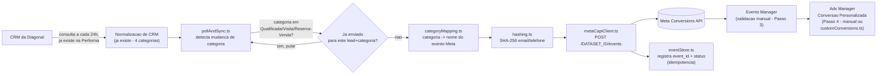

# Piloto CRM -> Meta Conversions API (Diagonal) - Pacote completo em arquivo unico

Gerado a partir de https://github.com/davimachado-ads/performa-capi-piloto-diagonal
Cole esta conversa inteira em qualquer chat com Claude para dar todo o contexto do piloto.

---

# Piloto: CRM → Meta Conversions API (Conta Diagonal)

> **Status: pacote teórico.** Nenhum código aqui foi executado ou testado contra
> infraestrutura real. Todo ponto que exigiria uma credencial, ID ou trecho do
> código existente da Performa está marcado com `[PLACEHOLDER_TEORICO]` ou
> descrito como "ASSUMIDO". Este README é o ponto de entrada — leia antes de
> mexer em qualquer arquivo de `src/`.

## 1. O que este pacote resolve

A Performa já normaliza qualquer CRM em 4 categorias (Desqualificada,
Qualificada, Visita, Reserva/Venda) e já cria Público Personalizado no Meta a
partir disso — **isso não faz parte deste pacote**.

O que falta, e é o que este pacote implementa: pegar a mudança de categoria de
um lead e mandar isso pro Meta como **evento de conversão via Conversions API
(CAPI)**, atrelado ao Dataset/pixel da conta Diagonal, para depois virar uma
Conversão Personalizada selecionável no Ads Manager.

Escopo: piloto de uma conta só (Diagonal). Nada aqui deve rodar para outros
clientes até o piloto ser validado (ver seção 7, Definição de Pronto).

## 2. Suposições assumidas (documentar antes de portar para o repo real)

Estas são decisões que tomei sem informação do briefing, para poder escrever
código real em vez de pseudocódigo. Revise cada uma antes de integrar:

| Suposição | Por quê | Se estiver errada |
|---|---|---|
| Stack: TypeScript/Node.js | Não foi informado no briefing. Escolhido por portabilidade — mais fácil de traduzir para qualquer outra stack do que pseudocódigo. | Traduza a *lógica* de cada arquivo (o contrato de dados e o payload da CAPI são o que realmente importa manter) para a linguagem real da Performa. |
| Banco: Postgres | Assumido pelo padrão comum em stacks Node/TS. | Adapte `db/schema.sql` para o dialeto real (MySQL, etc.) |
| Existe uma função/serviço que expõe o estado normalizado atual de cada lead (`getNormalizedLeadStatuses`, ver `src/pollAndSync.ts`) | O briefing confirma que a normalização já existe, mas não descreve a interface de acesso a ela. | Troque a declaração `declare function` em `pollAndSync.ts` pela chamada real ao módulo existente da Performa. |
| Nome de evento para "Qualificada" = `Lead` (padrão Meta), não custom `Qualified` | O briefing deixa as duas opções em aberto. `Lead` é evento **padrão**, o que permite objetivo de campanha nativo "Geração de Leads"; `Qualified` seria customizado, mais preciso semanticamente mas só usável via Conversão Personalizada/otimização manual. | Trocar em `src/categoryMapping.ts`, é uma linha. Decisão de negócio, não técnica — vale confirmar com o cliente/Nuno antes do piloto real. |
| Leads da Diagonal são todos BR (DDI 55) | Não informado. Afeta a normalização de telefone antes do hash (Meta exige E.164). | Ajustar `normalizePhoneBR` em `src/hashing.ts` se houver leads internacionais. |
| Um scheduler externo (cron, worker, etc.) já existe na Performa e só precisa apontar para uma nova rotina | O briefing descreve "consulta periódica a cada 24h" como já implementada — este pacote assume que só falta plugar a lógica de envio nessa rotina existente. | `scripts/run-daily-poll.ts` é o ponto de entrada a ser chamado por esse scheduler. |

## 3. Arquitetura



## 4. Mapa de arquivos

```
performa-capi-piloto-diagonal/
├── README.md                    este arquivo
├── db/
│   └── schema.sql                tabela nova: meta_conversion_events (idempotencia + auditoria)
├── src/
│   ├── config.ts                 env vars, allowlist do piloto, placeholders
│   ├── types.ts                  contratos de dados (NormalizedCategory, ConversionEvent, etc.)
│   ├── hashing.ts                normalizacao + SHA-256 de email/telefone (exigencia da Meta)
│   ├── categoryMapping.ts        categoria normalizada -> evento Meta (Diagonal)
│   ├── metaCapiClient.ts         monta o payload e chama a Conversions API
│   ├── eventStore.ts             idempotencia: nunca reenviar o mesmo lead+categoria
│   └── pollAndSync.ts            a rotina em si: le leads, detecta mudanca, envia
└── scripts/
    ├── send-test-events.ts       Passo 2 do piloto: 1 evento de teste por categoria
    ├── run-daily-poll.ts         ponto de entrada para o scheduler de producao
    └── create-custom-conversions.ts   Passo 4 automatizado (opcional - ver secao 6)
```

## 5. Variáveis de ambiente / credenciais necessárias

Nenhuma tem valor real neste pacote — são todas placeholders a preencher na
hora de rodar de verdade.

| Variável | Descrição | Onde conseguir |
|---|---|---|
| `META_SYSTEM_USER_TOKEN_DIAGONAL` | Token do system user com permissão "Gerenciar Pixel" no dataset da Diagonal | Business Manager da Diagonal → Configurações do Negócio → Usuários do Sistema |
| `META_DATASET_ID_DIAGONAL` | ID do Pixel/Dataset da Diagonal | Business Manager → Events Manager → Configurações da Fonte de Dados |
| `META_TEST_EVENT_CODE_DIAGONAL` | Código de teste (só usado no Passo 2/3 da validação, **remover depois**) | Events Manager da Diagonal → aba "Testar Eventos" |
| `DIAGONAL_CLIENT_ID` | ID interno do cliente Diagonal dentro da Performa | Banco de dados / painel admin da Performa |
| `DATABASE_URL` | Connection string do Postgres da Performa | Já existe na infra da Performa |

## 6. O que este pacote automatiza vs. o que continua manual

**Automatizado (código neste pacote):**
- Detecção de mudança de categoria (dado que a normalização já exista)
- Envio do evento via CAPI, com hash correto de `user_data`
- Idempotência (nunca reenviar o mesmo lead+categoria)
- Registro de sucesso/erro para auditoria
- Envio dos 3 eventos de teste do Passo 2 (`scripts/send-test-events.ts`)
- Criação da Conversão Personalizada via Marketing API (`scripts/create-custom-conversions.ts`) — **opcional**, o briefing descreve isso como passo manual no Ads Manager; o script é um atalho, não uma obrigação. Rode o manual se preferir ter controle visual do resultado antes do piloto.

**Continua manual (não dá pra automatizar com segurança, ou o briefing pede
verificação humana):**
- Passo 3 completo: conferir no Events Manager se os eventos chegaram com o
  `event_name` certo, e checar o **Event Match Quality (EMQ)**. A Meta não
  expõe o EMQ por uma API pública simples de consultar em tempo real — é uma
  métrica calculada e mostrada dentro do Events Manager. `emq_score` na tabela
  `meta_conversion_events` existe para você **anotar manualmente** o valor
  visto na UI, não para o sistema calcular sozinho.
- Confirmar que a consulta periódica de 24h está de fato rodando para a conta
  Diagonal (é uma verificação operacional, não algo que este pacote cria).
- Mover um lead de teste manualmente entre etapas no CRM da Diagonal (Passo 1
  do checklist do briefing).

## 7. Runbook do piloto (mapeado 1:1 com o checklist do briefing)

1. **Volume de leads.** Confirmar manualmente com o time se a Diagonal tem
   leads suficientes para um teste representativo. Fora do escopo de código.
2. **Acesso.** Preencher `META_SYSTEM_USER_TOKEN_DIAGONAL` e
   `META_DATASET_ID_DIAGONAL` nas variáveis de ambiente reais.
3. **Consulta periódica rodando.** Confirmar que o scheduler existente da
   Performa está de fato chamando `scripts/run-daily-poll.ts` (ou o
   equivalente após a tradução para a stack real) para `DIAGONAL_CLIENT_ID`.
4. **Teste de detecção.** Mover um lead de teste de etapa no CRM da Diagonal.
   Na próxima execução do poll, `pollAndSync.ts` deve detectar a mudança —
   conferir isso lendo a tabela `meta_conversion_events` (deve aparecer uma
   linha nova com `status = 'pending'` e depois `'sent'`).
5. **Eventos de teste.** Rodar `scripts/send-test-events.ts` uma vez — manda
   um evento por categoria (Qualificada/Visita/Reserva-Venda) usando
   `META_TEST_EVENT_CODE_DIAGONAL`.
6. **Validação no Events Manager.** Manual — ver seção 6. Preencher
   `emq_score` na tabela para os 3 eventos de teste depois de conferir na UI.
   Referência do briefing: só considerar aceitável **EMQ > 6** (escala 0–10).
7. **Conversão Personalizada.** Manual no Ads Manager, ou via
   `scripts/create-custom-conversions.ts` (opcional).
8. **Rodar com leads reais por alguns dias.** Deixar `run-daily-poll.ts`
   rodando de verdade para `DIAGONAL_CLIENT_ID` e observar a tabela
   `meta_conversion_events`.
9. **Documentar divergências.** Qualquer `status = 'failed'` na tabela, ou EMQ
   baixo, ou categoria mapeada errado, deve ser registrado antes de sequer
   pensar em replicar para outro cliente.

## 8. Limitações conhecidas (documentadas, não resolvidas neste piloto)

- **Latência de até 24h** entre a mudança de etapa no CRM e o envio à Meta,
  por causa do modelo de consulta periódica (não é webhook). A Meta aceita
  eventos com até 7 dias de atraso, então não há perda de dado — só de
  velocidade de otimização da campanha. Documentado no briefing como aceitável
  para o piloto.
- **EMQ depende de dado que talvez não exista.** Se o lead não tiver
  `fbc`/`fbp` preservados desde a origem (isso depende do Passo 1 do documento
  do Nuno, fora do escopo deste piloto), o EMQ tende a ficar mais baixo mesmo
  com email/telefone presentes. Vale confirmar isso ANTES de rodar o piloto,
  não depois.
- **`event_id` aqui protege contra retry do nosso próprio sistema**, não
  contra duplicação com um Pixel client-side — como estes são eventos
  100% server-side originados no CRM (não há JS de Pixel disparando o mesmo
  evento no navegador do lead), a deduplicação client+server clássica da Meta
  não se aplica da mesma forma. Exceção: se o site da Diagonal também dispara
  um Pixel padrão `Lead` no front-end quando o formulário é preenchido, pode
  haver **dois eventos `Lead` distintos** (um do Pixel, um deste pacote) que a
  Meta NÃO vai deduplicar automaticamente, porque são momentos/`event_id`
  diferentes. Vale mapear se isso acontece antes do piloto.

## 9. Definição de "pronto" (copiado do briefing, não reinterpretado)

> O piloto está validado quando: um lead real da Diagonal muda de etapa no
> CRM, o sistema detecta essa mudança dentro da janela de consulta de 24h, o
> evento correto chega ao Dataset da Diagonal via CAPI com EMQ aceitável, e a
> Conversão Personalizada correspondente aparece disponível e contabilizando
> no Ads Manager, sem nenhuma ação manual no meio do processo.

"Sem nenhuma ação manual no meio do processo" refere-se ao **fluxo de dados em
si** (detecção → envio → disponibilização) — a checagem humana do EMQ no
Events Manager (item 6 do runbook) é validação do piloto, não parte do fluxo
recorrente que continua depois de validado.

## 10. Referências

- Meta — Conversions API for CRM: https://developers.facebook.com/documentation/ads-commerce/conversions-api/conversion-leads-integration
- Meta — Envio de eventos offline via Conversions API: https://developers.facebook.com/documentation/ads-commerce/conversions-api/offline-events

---

## Arquivo: `db/schema.sql`

```sql
-- ASSUMIDO: dialeto Postgres (ver README.md secao 2). Adaptar se a Performa
-- usar outro banco.
--
-- Esta tabela e a UNICA peca de estado nova que este piloto precisa. Ela
-- serve dois propositos ao mesmo tempo:
--   1. Idempotencia: a constraint UNIQUE(lead_id, category) garante que o
--      mesmo lead nunca dispara duas vezes o mesmo evento de categoria,
--      mesmo que o poll rode mais de uma vez sobre o mesmo estado.
--   2. Auditoria: cada linha e um registro do que foi (ou tentou ser)
--      enviado a Meta, com o resultado - necessario pro Passo 9 do runbook
--      ("documentar qualquer divergencia antes de replicar").

CREATE TABLE IF NOT EXISTS meta_conversion_events (
  id SERIAL PRIMARY KEY,

  -- ID do cliente dentro da Performa (ex: Diagonal). Ver config.ts.
  client_id TEXT NOT NULL,

  -- ID do lead dentro do CRM/Performa (o mesmo ID usado pela normalizacao
  -- de funil existente).
  lead_id TEXT NOT NULL,

  category TEXT NOT NULL CHECK (category IN ('qualificada', 'visita', 'reserva_venda')),

  -- Nome do evento efetivamente enviado a Meta (Lead, Visit, Purchase,
  -- Reservation, Qualified...). Guardado aqui porque o mapeamento categoria
  -- -> evento pode mudar ao longo do tempo (ver categoryMapping.ts) e
  -- precisamos saber o que foi enviado historicamente, nao o mapeamento atual.
  event_name TEXT NOT NULL,

  -- UUID gerado no momento em que o evento e enfileirado, ANTES de chamar a
  -- Meta. Reenvios (por causa de erro de rede, por exemplo) devem reusar o
  -- mesmo event_id em vez de gerar um novo - ver eventStore.ts.
  event_id UUID NOT NULL UNIQUE,

  -- Horario REAL da mudanca de etapa no CRM, nao o horario em que o poll
  -- rodou (o briefing e explicito sobre essa distincao no Passo 2).
  event_time TIMESTAMPTZ NOT NULL,

  status TEXT NOT NULL DEFAULT 'pending' CHECK (status IN ('pending', 'sent', 'failed')),

  -- Resposta crua da Meta, para debug quando status = 'failed'.
  http_status INTEGER,
  response_body JSONB,

  -- Preenchido MANUALMENTE apos conferir no Events Manager (Passo 3 do
  -- runbook). A Meta nao expõe isso via API simples - ver README secao 6.
  emq_score NUMERIC,

  created_at TIMESTAMPTZ NOT NULL DEFAULT now(),
  sent_at TIMESTAMPTZ,

  -- Garante a idempotencia descrita acima: um lead so pode ter UM evento
  -- registrado por categoria, para sempre.
  UNIQUE (lead_id, category)
);

CREATE INDEX IF NOT EXISTS idx_meta_conversion_events_client
  ON meta_conversion_events (client_id);

CREATE INDEX IF NOT EXISTS idx_meta_conversion_events_status
  ON meta_conversion_events (status);
```

## Arquivo: `package.json`

```json
{
  "name": "performa-capi-piloto-diagonal",
  "version": "0.1.0",
  "private": true,
  "description": "Piloto teorico: envio de conversoes do CRM (Diagonal) para Meta via Conversions API. Ver README.md.",
  "scripts": {
    "build": "tsc --noEmit",
    "poll": "ts-node scripts/run-daily-poll.ts",
    "test-events": "ts-node scripts/send-test-events.ts",
    "create-custom-conversions": "ts-node scripts/create-custom-conversions.ts"
  },
  "dependencies": {
    "pg": "^8.13.0"
  },
  "devDependencies": {
    "@types/node": "^22.0.0",
    "@types/pg": "^8.11.0",
    "ts-node": "^10.9.0",
    "typescript": "^5.6.0"
  }
}
```

## Arquivo: `tsconfig.json`

```json
{
  "compilerOptions": {
    "target": "ES2022",
    "lib": ["ES2022"],
    "module": "commonjs",
    "moduleResolution": "node",
    "strict": true,
    "esModuleInterop": true,
    "skipLibCheck": true,
    "forceConsistentCasingInFileNames": true,
    "resolveJsonModule": true,
    "noUnusedLocals": true,
    "noUnusedParameters": true,
    "outDir": "dist"
  },
  "include": ["src/**/*.ts", "scripts/**/*.ts"]
}
```

## Arquivo: `.gitignore`

```
node_modules
dist
*.tsbuildinfo
.env
.env.local
```

## Arquivo: `src/types.ts`

```ts
// Contratos de dados do pacote. Nao ha logica aqui, so tipos - centralizado
// para o resto do codigo (e quem for portar isso pra outra stack) ter um
// unico lugar de referencia.

// As 4 categorias universais que a Performa ja normaliza. "desqualificada"
// existe no domínio geral da Performa mas NUNCA gera evento CAPI neste
// piloto (ver categoryMapping.ts) - incluida aqui so para o tipo bater com
// o que a normalizacao real provavelmente retorna.
export type NormalizedCategory = "desqualificada" | "qualificada" | "visita" | "reserva_venda";

// As 3 categorias que de fato importam para este piloto.
export const TARGET_CATEGORIES: readonly NormalizedCategory[] = [
  "qualificada",
  "visita",
  "reserva_venda",
];

// ASSUMIDO: contrato do que a normalizacao de CRM ja existente na Performa
// deveria expor. Ver README.md secao 2 - trocar pela interface real.
export type NormalizedLeadStatus = {
  leadId: string;
  clientId: string;
  category: NormalizedCategory;

  // Horario real da mudanca de etapa dentro do CRM (nao o horario da
  // consulta/poll). O briefing e explicito que event_time deve refletir isso.
  categoryChangedAt: Date;

  // Dados de contato do lead, formato bruto (normalizacao/hash acontece em
  // hashing.ts, nunca antes de chegar aqui).
  email?: string;
  phone?: string;

  // Identificadores de origem do Meta Pixel, SE tiverem sido preservados
  // desde a captura do lead (depende do Passo 1 do documento do Nuno,
  // fora do escopo deste piloto - ver README secao 8).
  fbc?: string;
  fbp?: string;

  // Valor da negociacao, quando disponivel e a categoria for reserva_venda.
  // Se ausente, o mapeamento cai no evento customizado "Reservation" em vez
  // de "Purchase" (ver categoryMapping.ts).
  dealValue?: number;
  dealCurrency?: string; // ex: "BRL"
};

// Nomes de evento que este piloto pode enviar a Meta. "Lead" e "Purchase"
// sao eventos PADRAO da Meta; "Visit", "Reservation" e "Qualified" sao
// customizados (nao tem semantica especial pro algoritmo de leilao, mas
// ainda assim viram Conversao Personalizada no Passo 4).
export type MetaCapiEventName = "Lead" | "Purchase" | "Qualified" | "Visit" | "Reservation";

export type ConversionEvent = {
  eventId: string; // UUID, gerado uma unica vez por lead+categoria
  clientId: string;
  leadId: string;
  category: Exclude<NormalizedCategory, "desqualificada">;
  eventName: MetaCapiEventName;
  eventTimeUnixSeconds: number;
  userData: {
    emailHash?: string; // SHA-256, ja normalizado (ver hashing.ts)
    phoneHash?: string; // SHA-256, ja em E.164 antes do hash
    fbc?: string;
    fbp?: string;
  };
  customData?: {
    value?: number;
    currency?: string;
  };
};

export type SendResult = {
  success: boolean;
  httpStatus: number;
  body: unknown;
};
```

## Arquivo: `src/config.ts`

```ts
// Toda credencial aqui e um PLACEHOLDER TEORICO. Nada disto e um segredo
// real - substitua por variaveis de ambiente de verdade (process.env) na
// hora de portar para o repositorio real da Performa.
//
// Estrutura pensada para o piloto (1 cliente hardcoded) mas ja no formato
// que escala para "credenciais por cliente" quando isso for liberado para
// mais contas - ver README secao 1 (escopo).

export type ClientMetaCredentials = {
  systemUserToken: string;
  datasetId: string;
  // So preenchido durante a fase de validacao (Passo 2/3 do runbook).
  // Remover/deixar undefined antes de considerar o piloto "em producao",
  // porque test_event_code segrega os eventos pra aba de teste do Events
  // Manager em vez de contar como evento real.
  testEventCode?: string;
};

export const DIAGONAL_CLIENT_ID = "[ID_CLIENTE_DIAGONAL_TEORICO]";

// Escopo do piloto: SOMENTE os client_id nesta lista disparam o fluxo de
// pollAndSync.ts. Qualquer outro cliente da Performa e ignorado, mesmo que
// tenha a normalizacao de CRM configurada - e um piloto controlado, nao
// um rollout geral (ver briefing, "Escopo do piloto").
export const PILOT_CLIENT_IDS: readonly string[] = [DIAGONAL_CLIENT_ID];

// ASSUMIDO: em producao (pos-piloto, multi-cliente) isso deveria vir de uma
// tabela `client_meta_credentials` no banco, nao hardcoded no codigo. Para o
// piloto de conta unica, um mapa em memoria e suficiente e mais simples de
// auditar.
export const CLIENT_META_CREDENTIALS: Record<string, ClientMetaCredentials> = {
  [DIAGONAL_CLIENT_ID]: {
    systemUserToken: "[META_SYSTEM_USER_TOKEN_TEORICO]",
    datasetId: "[META_DATASET_ID_TEORICO]",
    testEventCode: "[META_TEST_EVENT_CODE_TEORICO]",
  },
};

export function getCredentials(clientId: string): ClientMetaCredentials {
  const creds = CLIENT_META_CREDENTIALS[clientId];
  if (!creds) {
    throw new Error(
      `Nenhuma credencial Meta configurada para o cliente ${clientId}. ` +
        `Isso e esperado se o cliente nao faz parte do piloto (ver PILOT_CLIENT_IDS).`
    );
  }
  return creds;
}

export const META_API_VERSION = "v24.0";
export const META_GRAPH_BASE_URL = "https://graph.facebook.com";

// ASSUMIDO: connection string do Postgres da Performa. Ver db/schema.sql.
export const DATABASE_URL = "[DATABASE_URL_TEORICO]";
```

## Arquivo: `src/hashing.ts`

```ts
// Normalizacao + hash de identificadores do lead, exatamente como a Meta
// exige para user_data.em / user_data.ph na Conversions API. Fazer isso
// errado e a causa mais comum de EMQ baixo (Passo 3 do runbook) mesmo
// quando o dado esta presente.
//
// Referencia: https://developers.facebook.com/docs/marketing-api/conversions-api/parameters/customer-information-parameters

import { createHash } from "crypto";

export function hashSha256(value: string): string {
  return createHash("sha256").update(value).digest("hex");
}

// Meta exige: minusculo, sem espacos nas pontas. Nao remove pontos/apelidos
// do gmail nem nada alem disso - a Meta faz o dela, nao duplique normalizacao
// alem do documentado.
export function normalizeEmail(email: string): string {
  return email.trim().toLowerCase();
}

export function hashEmail(email: string): string {
  return hashSha256(normalizeEmail(email));
}

// Meta exige telefone em E.164 SEM o "+" antes do hash (ex: "5511999999999").
//
// ASSUMIDO (ver README secao 2): leads da Diagonal sao todos BR. Se o
// numero ja vier com DDI 55, nao duplicamos; caso contrario prefixamos.
// Isso e uma simplificacao esperada para o piloto de conta unica - uma
// versao multi-pais precisaria saber o pais de origem do lead, nao so
// assumir BR.
export function normalizePhoneBR(rawPhone: string): string {
  const digitsOnly = rawPhone.replace(/\D/g, "");
  if (digitsOnly.startsWith("55") && digitsOnly.length >= 12) {
    return digitsOnly;
  }
  return `55${digitsOnly}`;
}

export function hashPhone(rawPhone: string): string {
  return hashSha256(normalizePhoneBR(rawPhone));
}
```

## Arquivo: `src/categoryMapping.ts`

```ts
// Mapeamento categoria normalizada -> evento Meta, especifico da Diagonal
// (o briefing e explicito que isso e por cliente - outras contas podem
// querer nomes de evento diferentes quando o piloto for replicado).

import { MetaCapiEventName, NormalizedLeadStatus } from "./types";

export type MappingResult = {
  eventName: MetaCapiEventName;
  customData?: { value?: number; currency?: string };
};

// Decisao tomada (ver README secao 2, tabela de suposicoes):
//   - qualificada -> "Lead" (evento PADRAO da Meta, nao customizado).
//     Alternativa deixada em aberto pelo briefing: evento customizado
//     "Qualified". Trocar aqui e a unica mudanca necessaria se a decisao
//     de negocio for essa.
//   - visita -> "Visit" (customizado, a Meta nao tem padrao equivalente).
//   - reserva_venda -> "Purchase" SE houver valor de negociacao conhecido,
//     senao "Reservation" (customizado). Ver logica em mapCategoryToEvent.
export function mapCategoryToEvent(lead: NormalizedLeadStatus): MappingResult {
  switch (lead.category) {
    case "qualificada":
      return { eventName: "Lead" };

    case "visita":
      return { eventName: "Visit" };

    case "reserva_venda":
      if (lead.dealValue !== undefined && lead.dealCurrency) {
        return {
          eventName: "Purchase",
          customData: { value: lead.dealValue, currency: lead.dealCurrency },
        };
      }
      // Sem valor conhecido ainda (ex: "Em negociacao" classificado como
      // reserva_venda mas sem ticket fechado) - evento customizado sem
      // custom_data, conforme o briefing sugere.
      return { eventName: "Reservation" };

    case "desqualificada":
      throw new Error(
        "mapCategoryToEvent nunca deveria ser chamado para 'desqualificada' - " +
          "filtrar por TARGET_CATEGORIES antes de chegar aqui (ver pollAndSync.ts)."
      );
  }
}
```

## Arquivo: `src/metaCapiClient.ts`

```ts
// Cliente HTTP puro para a Meta Conversions API. Nao sabe nada sobre CRM,
// polling ou banco - so recebe um ConversionEvent ja pronto e manda.
//
// Referencia do endpoint: POST /{DATASET_ID}/events
// https://developers.facebook.com/docs/marketing-api/conversions-api/using-the-api

import { META_API_VERSION, META_GRAPH_BASE_URL } from "./config";
import { ConversionEvent, SendResult } from "./types";

type CapiPayload = {
  data: {
    event_name: string;
    event_time: number;
    event_id: string;
    action_source: "system_generated";
    user_data: {
      em?: string[];
      ph?: string[];
      fbc?: string;
      fbp?: string;
    };
    custom_data?: {
      value?: number;
      currency?: string;
    };
  }[];
  test_event_code?: string;
  access_token: string;
};

function buildPayload(event: ConversionEvent, accessToken: string, testEventCode?: string): CapiPayload {
  return {
    data: [
      {
        event_name: event.eventName,
        event_time: event.eventTimeUnixSeconds,
        event_id: event.eventId,
        // Evento originado por integracao server-to-server, nao por
        // interacao direta do usuario no site/app - exatamente o caso do
        // briefing (dado vindo do CRM, nao de um Pixel client-side).
        action_source: "system_generated",
        user_data: {
          // Meta aceita (e recomenda) arrays, mesmo com um unico hash.
          em: event.userData.emailHash ? [event.userData.emailHash] : undefined,
          ph: event.userData.phoneHash ? [event.userData.phoneHash] : undefined,
          fbc: event.userData.fbc,
          fbp: event.userData.fbp,
        },
        custom_data: event.customData,
      },
    ],
    ...(testEventCode ? { test_event_code: testEventCode } : {}),
    access_token: accessToken,
  };
}

export async function sendConversionEvent(
  datasetId: string,
  accessToken: string,
  event: ConversionEvent,
  testEventCode?: string
): Promise<SendResult> {
  const url = `${META_GRAPH_BASE_URL}/${META_API_VERSION}/${datasetId}/events`;
  const payload = buildPayload(event, accessToken, testEventCode);

  const res = await fetch(url, {
    method: "POST",
    headers: { "Content-Type": "application/json" },
    body: JSON.stringify(payload),
  });

  const body = await res.json().catch(() => null);

  return {
    success: res.ok,
    httpStatus: res.status,
    body,
  };
}
```

## Arquivo: `src/eventStore.ts`

```ts
// Camada de idempotencia e auditoria em cima de meta_conversion_events
// (db/schema.sql). E uma interface + uma implementacao de referencia em
// Postgres - se a Performa ja tem um jeito padrao de acessar banco (um ORM,
// um query builder), troque PostgresEventStore por isso, mantendo a
// interface EventStore igual, para o resto do pacote nao precisar mudar.

import { randomUUID } from "crypto";
import { Pool } from "pg"; // ASSUMIDO: driver 'pg' - trocar pelo client real da Performa
import { ConversionEvent, NormalizedCategory, SendResult } from "./types";

export interface EventStore {
  // true se ja existe um evento SENT (nao pending, nao failed) para este
  // lead+categoria - usado para pular leads ja processados no poll.
  hasSentEvent(leadId: string, category: NormalizedCategory): Promise<boolean>;

  // Cria a linha em status 'pending' e retorna o event_id a usar na chamada
  // a Meta. Se ja existir uma linha para este lead+categoria (por exemplo,
  // uma tentativa anterior que falhou), REUSA o event_id existente em vez
  // de criar um novo - e assim que a idempotencia de retry funciona.
  getOrCreatePendingEvent(event: Omit<ConversionEvent, "eventId">): Promise<string>;

  markResult(eventId: string, result: SendResult): Promise<void>;
}

export class PostgresEventStore implements EventStore {
  constructor(private pool: Pool) {}

  async hasSentEvent(leadId: string, category: NormalizedCategory): Promise<boolean> {
    const res = await this.pool.query<{ exists: boolean }>(
      `SELECT EXISTS (
         SELECT 1 FROM meta_conversion_events
         WHERE lead_id = $1 AND category = $2 AND status = 'sent'
       ) AS exists`,
      [leadId, category]
    );
    return res.rows[0].exists;
  }

  async getOrCreatePendingEvent(event: Omit<ConversionEvent, "eventId">): Promise<string> {
    // ON CONFLICT DO UPDATE ... RETURNING e o jeito de fazer
    // "get-or-create" atomico em Postgres: se ja existe uma linha para
    // este lead_id+category (de uma tentativa anterior), so devolvemos o
    // event_id existente sem gerar um novo nem sobrescrever o status.
    const newEventId = randomUUID();

    const res = await this.pool.query<{ event_id: string }>(
      `INSERT INTO meta_conversion_events
         (client_id, lead_id, category, event_name, event_id, event_time, status)
       VALUES ($1, $2, $3, $4, $5, to_timestamp($6), 'pending')
       ON CONFLICT (lead_id, category) DO UPDATE SET
         -- no-op proposital: mantem a linha existente intacta, so
         -- forcamos o RETURNING a trazer o event_id ja gravado.
         lead_id = meta_conversion_events.lead_id
       RETURNING event_id`,
      [
        event.clientId,
        event.leadId,
        event.category,
        event.eventName,
        newEventId,
        event.eventTimeUnixSeconds,
      ]
    );

    return res.rows[0].event_id;
  }

  async markResult(eventId: string, result: SendResult): Promise<void> {
    await this.pool.query(
      `UPDATE meta_conversion_events
       SET status = $2, http_status = $3, response_body = $4,
           sent_at = CASE WHEN $2 = 'sent' THEN now() ELSE sent_at END
       WHERE event_id = $1`,
      [eventId, result.success ? "sent" : "failed", result.httpStatus, JSON.stringify(result.body)]
    );
  }
}
```

## Arquivo: `src/pollAndSync.ts`

```ts
// O coracao do piloto: le o estado normalizado atual dos leads de um
// cliente, filtra o que interessa, e envia para a Meta o que ainda nao foi
// enviado. Pensado para ser chamado uma vez por execucao do scheduler de
// 24h (ver scripts/run-daily-poll.ts) - nao mantem estado em memoria entre
// chamadas, tudo que precisa persistir vive em meta_conversion_events.

import { getCredentials, PILOT_CLIENT_IDS } from "./config";
import { EventStore } from "./eventStore";
import { hashEmail, hashPhone } from "./hashing";
import { sendConversionEvent } from "./metaCapiClient";
import { mapCategoryToEvent } from "./categoryMapping";
import { ConversionEvent, NormalizedLeadStatus, TARGET_CATEGORIES } from "./types";

// ============================================================================
// ASSUMIDO (ver README.md secao 2): isto ja existe na Performa como parte da
// normalizacao de CRM descrita no briefing. O contrato abaixo e uma
// suposicao de como essa funcao provavelmente se parece - trocar pela
// chamada real ao modulo existente (provavelmente algo em torno da tela
// "Etapas do funil no CRM" mencionada no briefing).
//
// Import real seria algo como:
//   import { getNormalizedLeadStatuses } from "../funil/normalizacao";
// ============================================================================
declare function getNormalizedLeadStatuses(clientId: string): Promise<NormalizedLeadStatus[]>;

function toConversionEventInput(lead: NormalizedLeadStatus): Omit<ConversionEvent, "eventId"> {
  const mapping = mapCategoryToEvent(lead);

  return {
    clientId: lead.clientId,
    leadId: lead.leadId,
    category: lead.category as Exclude<NormalizedLeadStatus["category"], "desqualificada">,
    eventName: mapping.eventName,
    eventTimeUnixSeconds: Math.floor(lead.categoryChangedAt.getTime() / 1000),
    userData: {
      emailHash: lead.email ? hashEmail(lead.email) : undefined,
      phoneHash: lead.phone ? hashPhone(lead.phone) : undefined,
      fbc: lead.fbc,
      fbp: lead.fbp,
    },
    customData: mapping.customData,
  };
}

export type PollResult = {
  clientId: string;
  leadsEvaluated: number;
  eventsSent: number;
  eventsFailed: number;
  eventsSkipped: number; // ja tinham sido enviados antes
};

export async function pollAndSyncClient(
  clientId: string,
  eventStore: EventStore
): Promise<PollResult> {
  if (!PILOT_CLIENT_IDS.includes(clientId)) {
    throw new Error(
      `Cliente ${clientId} nao esta na lista PILOT_CLIENT_IDS - este piloto ` +
        `so deve rodar para contas explicitamente liberadas (ver config.ts).`
    );
  }

  const credentials = getCredentials(clientId);
  const allLeads = await getNormalizedLeadStatuses(clientId);
  const relevantLeads = allLeads.filter((lead) => TARGET_CATEGORIES.includes(lead.category));

  const result: PollResult = {
    clientId,
    leadsEvaluated: allLeads.length,
    eventsSent: 0,
    eventsFailed: 0,
    eventsSkipped: 0,
  };

  for (const lead of relevantLeads) {
    const alreadySent = await eventStore.hasSentEvent(lead.leadId, lead.category);
    if (alreadySent) {
      result.eventsSkipped++;
      continue;
    }

    const eventInput = toConversionEventInput(lead);
    const eventId = await eventStore.getOrCreatePendingEvent(eventInput);
    const event: ConversionEvent = { ...eventInput, eventId };

    const sendResult = await sendConversionEvent(
      credentials.datasetId,
      credentials.systemUserToken,
      event,
      credentials.testEventCode
    );

    await eventStore.markResult(eventId, sendResult);

    if (sendResult.success) {
      result.eventsSent++;
    } else {
      result.eventsFailed++;
    }
  }

  return result;
}
```

## Arquivo: `scripts/send-test-events.ts`

```ts
// Passo 2 do runbook: manda 1 evento de teste por categoria
// (Qualificada / Visita / Reserva-Venda) usando test_event_code, pra
// confirmar no Events Manager (Passo 3) que o formato do payload esta
// correto ANTES de deixar o poll de producao (run-daily-poll.ts) rodar
// sobre leads reais.
//
// Estes eventos usam dados FICTICIOS (nao sao leads reais) e
// propositalmente NAO passam pelo eventStore - test_event_code ja separa
// eles na aba "Testar Eventos" do Events Manager, entao nao precisam de
// idempotencia nem poluem a tabela de auditoria de producao.
//
// Rodar manualmente uma vez, nao faz parte do scheduler de 24h.

import { randomUUID } from "crypto";
import { DIAGONAL_CLIENT_ID, getCredentials } from "../src/config";
import { hashEmail, hashPhone } from "../src/hashing";
import { sendConversionEvent } from "../src/metaCapiClient";
import { ConversionEvent, NormalizedCategory } from "../src/types";
import { mapCategoryToEvent } from "../src/categoryMapping";

const TEST_LEAD_EMAIL = "teste.piloto.diagonal@exemplo.com";
const TEST_LEAD_PHONE = "11999999999"; // formato bruto, normalizado por hashPhone

// Tipado explicitamente sem "desqualificada" - essa categoria nunca gera
// evento (ver categoryMapping.ts) e o TypeScript precisa saber disso aqui
// para o objeto ConversionEvent mais abaixo tipar certo.
const TEST_CATEGORIES: Exclude<NormalizedCategory, "desqualificada">[] = [
  "qualificada",
  "visita",
  "reserva_venda",
];

async function main() {
  const credentials = getCredentials(DIAGONAL_CLIENT_ID);

  if (!credentials.testEventCode) {
    throw new Error(
      "META_TEST_EVENT_CODE_TEORICO nao configurado - pegue o codigo em " +
        "Events Manager da Diagonal > aba 'Testar Eventos' e preencha em config.ts."
    );
  }

  for (const category of TEST_CATEGORIES) {
    const mapping = mapCategoryToEvent({
      leadId: `teste-piloto-${category}`,
      clientId: DIAGONAL_CLIENT_ID,
      category,
      categoryChangedAt: new Date(),
      email: TEST_LEAD_EMAIL,
      phone: TEST_LEAD_PHONE,
      // Para o teste de "reserva_venda" simular COM valor, pra validar o
      // branch de custom_data tambem (ver categoryMapping.ts).
      dealValue: category === "reserva_venda" ? 350000 : undefined,
      dealCurrency: category === "reserva_venda" ? "BRL" : undefined,
    });

    const event: ConversionEvent = {
      eventId: randomUUID(),
      clientId: DIAGONAL_CLIENT_ID,
      leadId: `teste-piloto-${category}`,
      category,
      eventName: mapping.eventName,
      eventTimeUnixSeconds: Math.floor(Date.now() / 1000),
      userData: {
        emailHash: hashEmail(TEST_LEAD_EMAIL),
        phoneHash: hashPhone(TEST_LEAD_PHONE),
      },
      customData: mapping.customData,
    };

    const result = await sendConversionEvent(
      credentials.datasetId,
      credentials.systemUserToken,
      event,
      credentials.testEventCode
    );

    console.log(
      `[send-test-events] categoria=${category} evento=${mapping.eventName} ` +
        `sucesso=${result.success} http=${result.httpStatus}`
    );
    if (!result.success) {
      console.error(`[send-test-events] resposta da Meta:`, result.body);
    }
  }

  console.log(
    "\nAgora confira no Events Manager da Diagonal (aba 'Testar Eventos') " +
      "se os 3 eventos apareceram com o event_name correto, e anote o EMQ " +
      "de cada um na tabela meta_conversion_events (Passo 6 do runbook)."
  );
}

main();
```

## Arquivo: `scripts/run-daily-poll.ts`

```ts
// Ponto de entrada que o scheduler de 24h ja existente na Performa deve
// chamar (ver README secao 2 - assumimos que esse scheduler ja existe e so
// falta apontar pra cá). Roda para todos os clientes em PILOT_CLIENT_IDS -
// hoje so a Diagonal.
//
// Uso esperado (depois de traduzido pra stack real): agendar isso para
// rodar 1x/dia, no mesmo horario em que a consulta periodica ao CRM ja
// roda hoje (Passo 1 do briefing).

import { Pool } from "pg";
import { DATABASE_URL, PILOT_CLIENT_IDS } from "../src/config";
import { PostgresEventStore } from "../src/eventStore";
import { pollAndSyncClient } from "../src/pollAndSync";

async function main() {
  const pool = new Pool({ connectionString: DATABASE_URL });
  const eventStore = new PostgresEventStore(pool);

  for (const clientId of PILOT_CLIENT_IDS) {
    console.log(`[run-daily-poll] iniciando cliente ${clientId}`);
    try {
      const result = await pollAndSyncClient(clientId, eventStore);
      console.log(`[run-daily-poll] cliente ${clientId}:`, result);
    } catch (err) {
      // Um cliente falhar nao deve derrubar os outros - relevante quando
      // este piloto for replicado para mais de uma conta.
      console.error(`[run-daily-poll] erro no cliente ${clientId}:`, err);
    }
  }

  await pool.end();
}

main();
```

## Arquivo: `scripts/create-custom-conversions.ts`

```ts
// Passo 4 do runbook, versao automatizada - OPCIONAL.
//
// O briefing descreve este passo como manual (Ads Manager > Todas as
// Ferramentas > Conversoes Personalizadas > Criar). Este script e um
// atalho, nao uma substituicao obrigatoria - rode o manual primeiro se
// quiser validar visualmente antes de automatizar.
//
// ATENCAO (nivel de confianca menor que o resto do pacote): o endpoint
// /customconversions e usado com bem menos frequencia que /events, e o
// formato exato do campo `rule` ja mudou entre versoes da Marketing API no
// passado. CONFIRME os campos obrigatorios na documentacao oficial da
// versao em uso antes de rodar isto de verdade:
// https://developers.facebook.com/docs/marketing-api/reference/custom-conversion/

import { DIAGONAL_CLIENT_ID, META_API_VERSION, META_GRAPH_BASE_URL, getCredentials } from "../src/config";
import { MetaCapiEventName } from "../src/types";

// ASSUMIDO: ID da conta de anuncios da Diagonal (act_XXXXXXXXX), diferente
// do Dataset ID usado em metaCapiClient.ts.
const DIAGONAL_AD_ACCOUNT_ID = "[META_AD_ACCOUNT_ID_TEORICO]";

type CustomConversionSpec = {
  name: string;
  eventName: MetaCapiEventName;
};

// Uma Conversao Personalizada por categoria, conforme o briefing sugere
// ("repetir para as tres categorias, se fizer sentido reportar cada uma
// separadamente").
const CONVERSIONS_TO_CREATE: CustomConversionSpec[] = [
  { name: "Diagonal - Qualificada", eventName: "Lead" },
  { name: "Diagonal - Visita", eventName: "Visit" },
  { name: "Diagonal - Reserva/Venda", eventName: "Purchase" },
];

async function createCustomConversion(
  accessToken: string,
  spec: CustomConversionSpec
): Promise<unknown> {
  const url = `${META_GRAPH_BASE_URL}/${META_API_VERSION}/act_${DIAGONAL_AD_ACCOUNT_ID}/customconversions`;

  const body = {
    name: spec.name,
    custom_event_type: "OTHER",
    rule: JSON.stringify({ and: [{ event: { eq: spec.eventName } }] }),
    access_token: accessToken,
  };

  const res = await fetch(url, {
    method: "POST",
    headers: { "Content-Type": "application/json" },
    body: JSON.stringify(body),
  });

  const json = await res.json().catch(() => null);
  if (!res.ok) {
    throw new Error(`Falha ao criar '${spec.name}': HTTP ${res.status} - ${JSON.stringify(json)}`);
  }
  return json;
}

async function main() {
  const credentials = getCredentials(DIAGONAL_CLIENT_ID);

  for (const spec of CONVERSIONS_TO_CREATE) {
    try {
      const result = await createCustomConversion(credentials.systemUserToken, spec);
      console.log(`[create-custom-conversions] criada: ${spec.name}`, result);
    } catch (err) {
      console.error(`[create-custom-conversions] erro em ${spec.name}:`, err);
    }
  }

  console.log(
    "\nConfira no Ads Manager > Todas as Ferramentas > Conversoes Personalizadas " +
      "se as 3 aparecem e se estao disponiveis para selecao nas colunas de relatorio."
  );
}

main();
```

